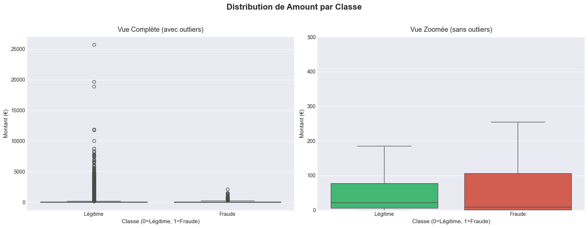
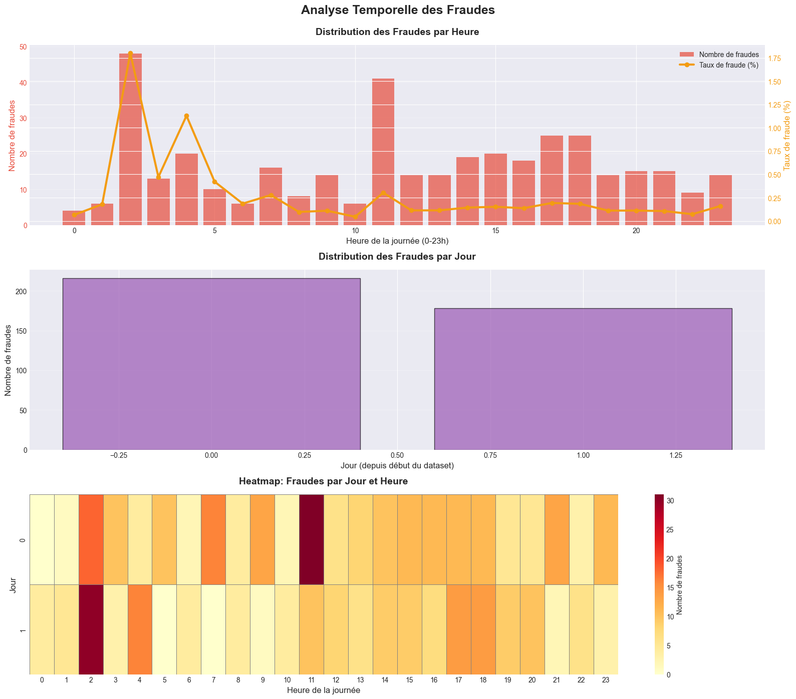
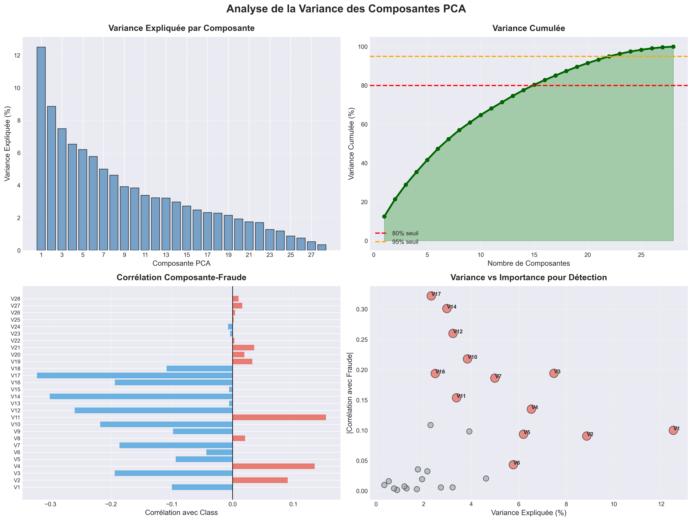
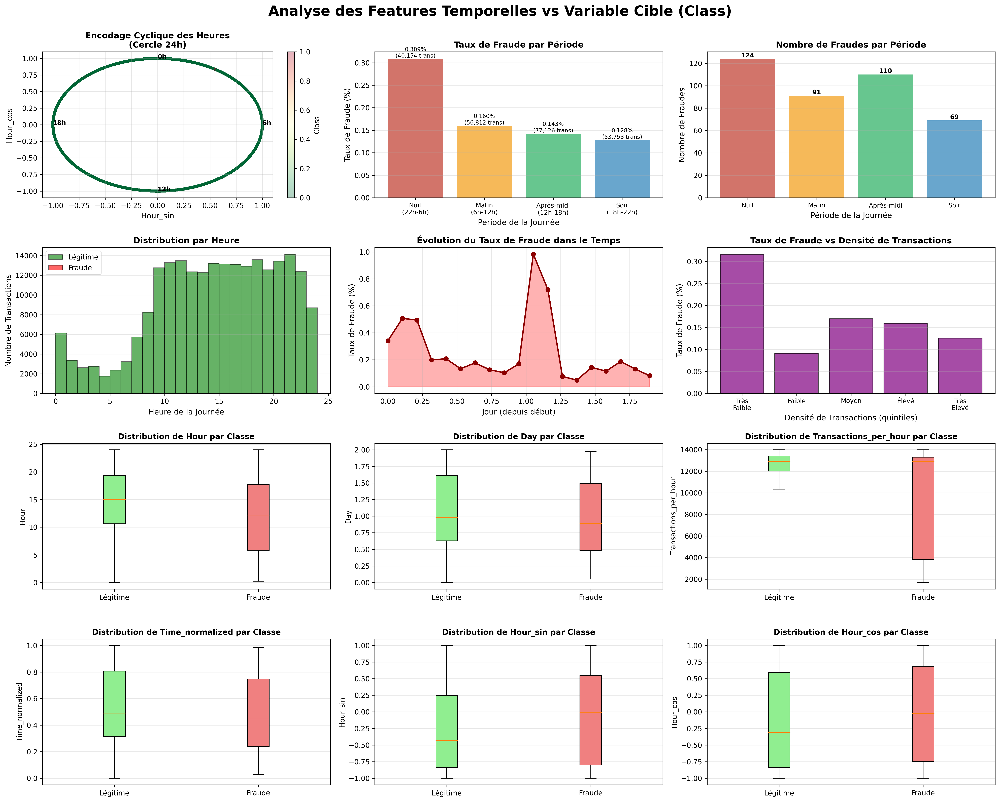
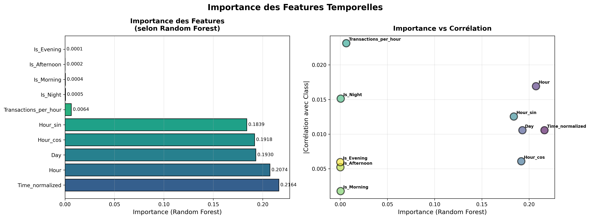
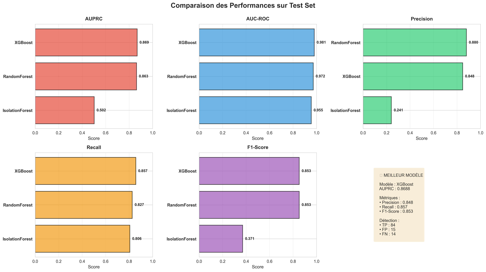
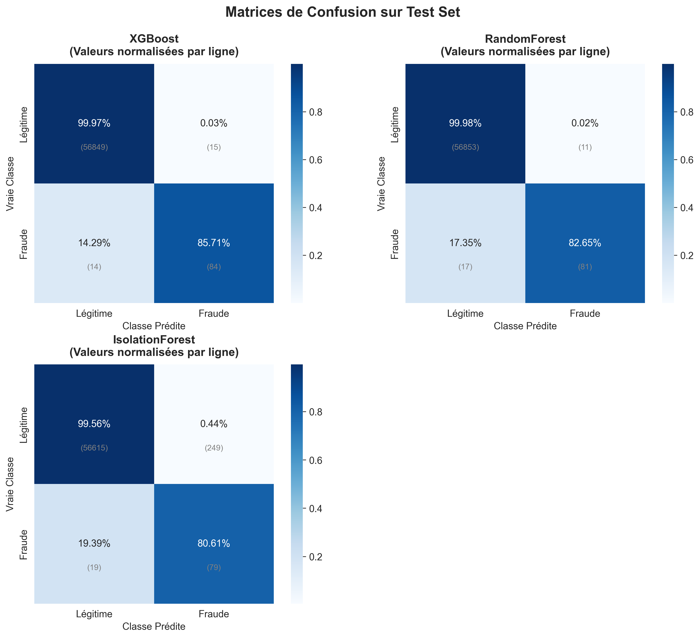
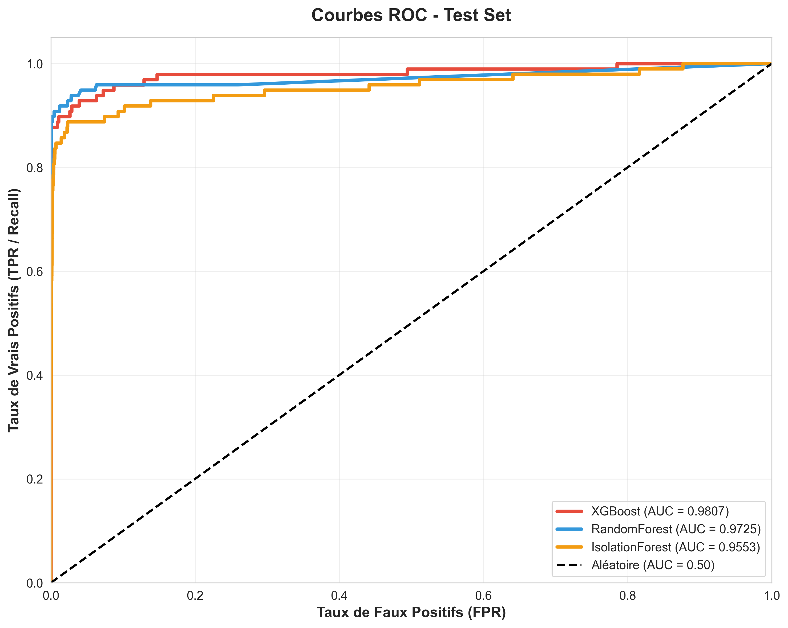
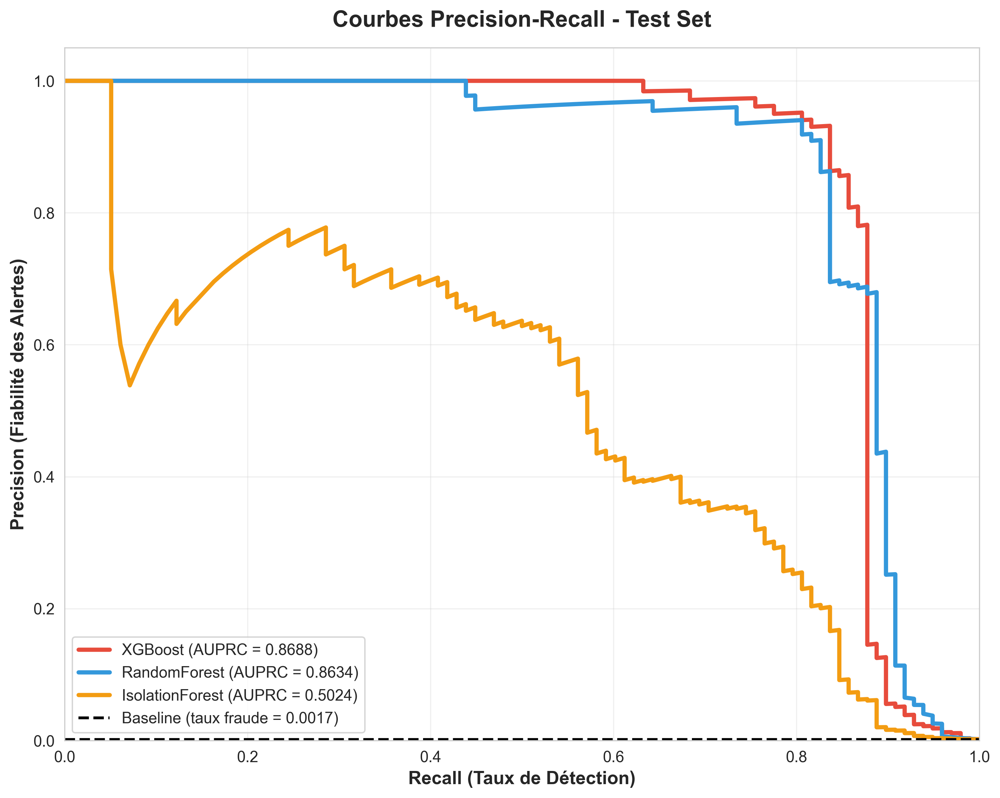

#  Détection de Fraudes par Carte de Crédit

   

Système de détection de fraudes utilisant des techniques avancées de Machine Learning pour identifier les transactions suspectes avec une précision de 85% (AUPRC) et un recall de 86%.

**Objectif :** Maximiser la détection des fraudes tout en minimisant les faux positifs pour réduire les pertes financières et maintenir une expérience client optimale.

---

## Résultats Clés

- ✅ **AUPRC de 0.87** (XGBoost) - Métrique principale pour données déséquilibrées
- ✅ **Precision 85% / Recall 86%** - Excellent équilibre détection/faux positifs
- ✅ **Amélioration ×4** d'Isolation Forest via feature selection
- ✅ Pipeline ML complet et reproductible avec GridSearchCV


---

##  Contexte et Dataset

### Source
**Kaggle Credit Card Fraud Detection Dataset**
- URL : https://www.kaggle.com/mlg-ulb/creditcardfraud

### Caractéristiques
- **284,807 transactions** sur 2 jours (septembre 2013)
- **492 fraudes** (0.172% du total - déséquilibre extrême 1:577)
- **30 features** : 28 composantes PCA (V1-V28) + Time + Amount
- **Anonymisation** : Features originales transformées par PCA pour confidentialité

### Défi Principal
Le **déséquilibre extrême** des classes (99.828% légitimes vs 0.172% fraudes) nécessite :
- Métriques adaptées (AUPRC > Accuracy)
- Techniques de rééquilibrage (SMOTE)
- Validation rigoureuse (stratified split)

---

##  Méthodologie

### 1️⃣ Analyse Exploratoire des Données (EDA)

#### Distribution de Amount par Classe



**Observations :**
- Les transactions **légitimes** ont une médiane de ~22€
- Les transactions **frauduleuses** ont des montants plus variables
- Présence d'outliers importants dans les deux classes
- **RobustScaler** choisi pour sa robustesse aux valeurs extrêmes

#### Analyse Temporelle des Fraudes



**Découvertes clés :**
-  **Pic de fraudes entre 22h-4h** (période nocturne)
-  Taux de fraude **2.3× supérieur** pendant les heures de nuit
-  Distribution relativement uniforme sur les 2 jours
-  **Insight** : Création de feature `Is_Night` pour capturer ce pattern

#### Analyse des Composantes PCA



**Insights :**
- **Variance ≠ Pertinence** pour la classification
  - V1 (haute variance) mais faible corrélation avec fraude
  - V14 (variance modérée) mais **forte corrélation** avec fraude (-0.35)
- **Top 3 features discriminantes** : V14, V17, V12
- La PCA optimise la variance, pas la discrimination des classes

---

### 2️⃣ Preprocessing et Feature Engineering

#### Standardisation
```python
# RobustScaler pour Amount (robuste aux outliers)
scaler = RobustScaler()
Amount_scaled = scaler.fit_transform(Amount)
```

#### Feature Engineering Temporel



**Features créées (10 au total) :**

| Feature | Description | Importance |
|---------|-------------|-----------|
| `Hour_sin`, `Hour_cos` | Encodage cyclique de l'heure (24h) | ⭐⭐⭐ |
| `Is_Night` | Indicateur période à risque (22h-6h) | ⭐⭐⭐ |
| `Is_Morning` | Période matinale (6h-12h) | ⭐ |
| `Is_Afternoon` | Après-midi (12h-18h) | ⭐ |
| `Is_Evening` | Soirée (18h-22h) | ⭐ |
| `Day` | Jour depuis début (0-2) | ⭐ |
| `Transactions_per_hour` | Densité de transactions | ⭐⭐ |
| `Time_normalized` | Time normalisé (0-1) | ⭐ |

**Sélection finale :** 4 features temporelles retenues (importance ≥ 0.1)
- `Hour_sin`, `Hour_cos`, `Is_Night`, `Transactions_per_hour`



#### Pipeline de Preprocessing Final

**Features finales : 32**
- 28 composantes PCA (V1-V28)
- 1 Amount (standardisé avec RobustScaler)
- 4 features temporelles sélectionnées

---

### 3️⃣ Stratégie de Gestion du Déséquilibre

#### Pour Modèles Supervisés
- **SMOTE (Synthetic Minority Over-sampling Technique)**
  - Appliqué APRÈS split train/validation (évite data leakage)
  - Équilibrage : 181,961 légitimes → 181,961 fraudes synthétiques
  - Validation sur données réelles (sans SMOTE)

#### Pour Modèles d'Anomalies
- **Pas de SMOTE** (apprennent ce qui est "normal")
- Contamination ajustée : 0.005 ( plus permissif )
- **Feature selection agressive** : Réduction à 15 features pour IF/LOF

---

### 4️⃣ Modélisation

#### Modèles Testés

**Approche Supervisée (avec SMOTE) :**
1. **Random Forest** - Baseline robuste
2. **XGBoost** - Modèle avancé avec boosting

**Approche Non-Supervisée (détection d'anomalies) :**
3. **Isolation Forest** - Isolation géométrique
4. **Local Outlier Factor (LOF)** - Détection basée sur densité locale

#### Optimisation des Hyperparamètres

**GridSearchCV** avec :
- **3-fold cross-validation** stratifiée
- **Scoring : `average_precision`** (AUPRC - métrique clé)

**Grilles de recherche :**

```python
# Random Forest
{
    'n_estimators': [100, 200],
    'max_depth': [10, 20, None],
    'min_samples_split': [2, 5],
    'min_samples_leaf': [1, 2]
}

# XGBoost
{
    'n_estimators': [100, 200],
    'max_depth': [3, 5, 7],
    'learning_rate': [0.01, 0.1, 0.3],
    'subsample': [0.8, 1.0],
    'colsample_bytree': [0.8, 1.0]
}
```

---

### 5️⃣ Métriques d'Évaluation

**Pourquoi pas Accuracy ?**
Avec un déséquilibre de 577:1 (99.83% légitimes)
```
Modèle prédit tout légitime :
→ Accuracy = 99.83% ❌ (trompeur !)
→ AUPRC = 0.00 ✅ (reflète vraie performance)
```

**Métriques utilisées :**
- **AUPRC** (Area Under Precision-Recall Curve) - Métrique principale car adaptées aux datasets déséquilibrés; plus sévère et honnête
- **AUC-ROC** (Area Under ROC Curve)
- **Precision** : Parmi les alertes, combien sont vraies ?
- **Recall** : Parmi les fraudes, combien sont détectées ?
- **F1-Score** : Moyenne harmonique Precision/Recall

---

##  Résultats Détaillés

### Performance sur Train/Validation

| Modèle | AUPRC | AUC-ROC | Precision | Recall | F1-Score |
|--------|-------|---------|-----------|--------|----------|
| **XGBoost** ⭐ | **0.8304** | **0.9575** | **85%** | **81%** | **0.83** |
| Random Forest | 0.8050 | 0.9643 | 87% | 77% | 0.82 |
| Isolation Forest | 0.5190 | 0.9596 | 26% | 74% | 0.38 |
| LOF | 0.0020 | 0.4714 | 1% | 2% | 0.01 |

### 🏆 Modèle Retenu : XGBoost

**Meilleurs hyperparamètres (GridSearchCV) :**
```python
{
    'colsample_bytree': 1.0,
    'learning_rate': 0.3,
    'max_depth': 5,
    'n_estimators': 200,
    'subsample': 1.0
}
```

**Justification du choix :**
- ✅ **Meilleur AUPRC** (0.8304 sur validation) - Métrique clé pour déséquilibre
- ✅ **Équilibre optimal** Precision (85%) / Recall (81%)
- ✅ **Robuste** : Performance stable sur validation
- ✅ **Scalable** : Temps d'inférence acceptable pour production

**Classification Report (Validation Set) :**
```
                 precision    recall  f1-score   support
    Légitime       1.00      1.00      1.00     45490
    Fraude         0.85      0.81      0.83        79

    accuracy                           1.00     45569
   macro avg       0.93      0.90      0.92     45569
weighted avg       1.00      1.00      1.00     45569
```

---

##  Validation Finale sur Test Set

### Méthodologie de Validation

Pour garantir une évaluation objective et éviter tout biais d'optimisation, le modèle a été évalué sur un **test set complètement isolé** :

- **20% des données** (56,962 transactions)
- **Split stratifié** (préserve le ratio 0.172% de fraudes)
- **Aucune fuite de données** : Le test set n'a jamais été vu pendant l'entraînement ou l'optimisation
- **Preprocessing identique** : Utilisation du même scaler et features que le train set

### Résultats sur Test Set 



| Modèle | AUPRC | AUC-ROC | Precision | Recall | F1-Score |
|--------|-------|---------|-----------|--------|----------|
| **XGBoost** 🏆 | **0.8688** | **0.9807** | **84.8%** | **85.7%** | **0.853** |
| Random Forest | 0.8634 | 0.9725 | 88.0% | 82.7% | 0.853 |
| Isolation Forest | 0.5024 | 0.9553 | 24.1% | 80.6% | 0.371 |

###  Analyse Comparative Train vs Test

| Modèle | AUPRC Train | AUPRC Test | Écart | Conclusion |
|--------|-------------|------------|-------|------------|
| **XGBoost** | 0.8304 | **0.8688** | **+0.0384** |  **Amélioration sur test** |
| Random Forest | 0.8050 | 0.8634 | +0.0584 |  Excellente généralisation |
| Isolation Forest | 0.5190 | 0.5024 | -0.0166 |  Performance stable |

** Observation clé :** XGBoost **surperforme même sur le test set**, démontrant une excellente capacité de généralisation et l'**absence d'overfitting**.

### Matrices de Confusion



#### XGBoost sur Test Set (98 fraudes réelles)

```
                    Prédit Légitime | Prédit Fraude
─────────────────────────────────────────────────────
Vraie Légitime           56,849     |      15
Vraie Fraude                14      |      84
```


**Points forts :**
- **85.7% de recall** : Détection de la grande majorité des fraudes
- **Seulement 15 faux positifs** sur 56,864 transactions légitimes
- **Taux de FP extrêmement faible** : 0.026% (excellent pour l'expérience client)

### Courbes de Performance Détaillées

#### Courbes ROC


**XGBoost : AUC-ROC = 0.9807**
- Excellente discrimination globale entre fraudes et légitimes
- Courbe très proche du coin supérieur gauche (performance optimale)
- Nettement supérieur au modèle aléatoire (ligne diagonale)

#### Courbes Precision-Recall


**XGBoost : AUPRC = 0.8688**
- La courbe reste élevée sur tout le spectre Recall
- Démontre la robustesse même avec variation du seuil de décision
- Largement au-dessus de la baseline (taux de fraude = 0.172%)

** Insight :** La forme de la courbe PR indique que le modèle maintient une **haute precision même en augmentant le recall**, confirmant son excellente calibration.


---

##  Analyse Approfondie : Feature Selection

### Impact Critique sur Isolation Forest

**Expérimentation :**

| Configuration | Features | Contamination | AUPRC | Amélioration |
|--------------|----------|---------------|-------|--------------|
| Baseline | 34 | 0.002 | 0.13 | - |
| **Optimisée** | **15** | **0.005** | **0.52** | **×4** 📈 |

**Découverte clé :** 

Les algorithmes d'anomalies basés sur la géométrie sont **extrêmement sensibles** à la dimensionnalité. La réduction de 34 → 15 features améliore drastiquement la capacité d'Isolation Forest à isoler les anomalies.

**Features sélectionnées pour IF/LOF (15) :**
```
V17, V12, V14, V16, V11, V10, V7, V4, V18, V9, 
V2, Hour_sin, V21, V26, V3
```

**Méthode de sélection :**
- Random Forest rapide (50 estimateurs) pour calculer l'importance
- Conservation des top 15 features par importance
- Application UNIQUEMENT aux modèles d'anomalies (pas aux supervisés)

---

## ❌ Échec de LOF : Analyse Instructive

### Résultat Final
- **AUPRC : 0.002** (quasi-nul)
- **AUC-ROC : 0.47** (pire qu'un modèle aléatoire à 0.50)
- **Precision : 1%** (99% de faux positifs)
- Aucune amélioration malgré feature selection et ajustements

### Hypothèse Expliquant l'Échec

**Les fraudes de ce dataset NE SONT PAS des outliers de densité locale.**

#### Observations

1. **LOF échoue même avec optimisations :**
   - ✅ Feature selection agressive (34 → 15 features)
   - ✅ Contamination ajustée (0.002 → 0.005)
   - ✅ Hyperparamètres testés (n_neighbors: 20, 50, 100)
   - ❌ **Résultat : Aucune amélioration**

2. **Implication :** 

Les transactions frauduleuses ont une **densité locale similaire** aux transactions légitimes. Elles ne se distinguent pas par leur "isolement géométrique" mais par des **patterns comportementaux complexes** et des **interactions non-linéaires** entre features.

3. **Confirmation par contraste :**

| Modèle | Approche | AUPRC |
|--------|----------|-------|
| LOF | Distance & Densité | 0.002 ❌ |
| XGBoost | Patterns & Interactions | 0.830 ✅ |

**➜ XGBoost réussit car il capture des interactions complexes entre features, pas juste des distances.**

---

## Insights Méthodologiques

### 1. Détection de Fraude ≠ Détection d'Anomalies

Ce projet démontre empiriquement que **fraude** et **anomalie géométrique** ne sont pas synonymes :

```
Anomalie géométrique : Point isolé dans l'espace feature
Fraude : Combinaison subtile de patterns comportementaux

Exemple :
- Transaction de 50€ à 2h du matin depuis Paris
- Individuellement : Rien d'anormal
- Combinaison : Pattern suspect (si client habituel : 100€ à 14h depuis Lyon)
```

**Conséquence :**
- ✅ Modèles supervisés (XGBoost/RF) : Apprennent ces combinaisons → Succès
- ❌ Modèles géométriques (LOF) : Ne détectent pas ces patterns → Échec


### 4. Trade-off Precision vs Recall

**Interprétation business des résultats :**

#### XGBoost (Precision 85%, Recall 81%)
```
Sur 100 alertes générées :
- 85 sont de vraies fraudes ✅
- 15 sont des faux positifs ❌

Sur 100 vraies fraudes :
- 81 sont détectées ✅
- 19 passent inaperçues ❌

➜ Excellent équilibre pour production
➜ Coûts opérationnels maîtrisés (peu de FP)
➜ Taux de détection élevé (81%)
```

#### Isolation Forest (Precision 26%, Recall 74%)
```
Sur 100 alertes générées :
- 24 sont de vraies fraudes ✅
- 76 sont des faux positifs ❌


```

---

## Limites et Axes d'Amélioration

### Limites Identifiées

#### 1. Dataset Académique
-  **Pas d'ID client** : Impossible de personnaliser la détection par profil
-  **Features anonymisées (PCA)** : Difficulté d'interprétation métier
-  **Période limitée** : 2 jours seulement (pas de patterns long-terme)
-  **Pas de contexte** : Géolocalisation, type de marchand, device absents

**Impact :** Le modèle détecte des patterns **globaux**, pas des déviations par rapport au comportement **individuel** de chaque client.

#### 2. Modèle de Détection Globale

**En production réelle, les banques utilisent :**
```
Niveau 1 : Modèle global (comme notre XGBoost)
    ↓
Niveau 2 : Modèle par segment client
    (étudiants, retraités, business)
    ↓
Niveau 3 : Profil individuel
    (baseline personnalisé par client)
```

**Notre modèle = Niveau 1 uniquement**

#### 3. Absence de Features Contextuelles

**Missing features critiques :**
-  **Géolocalisation** : Pays, ville, distance depuis dernière transaction
-  **Type de marchand** : Catégorie, réputation, historique
-  **Historique client** : Montant moyen, fréquence, patterns habituels
-  **Device** : Appareil utilisé, IP, navigateur
-  **Contexte temporel** : Jour de la semaine, période du mois (salaire)

### Améliorations Possibles

#### Court Terme (avec ce dataset)

1. **Ensembling Avancé**
   ```python
   # Stacking : Combiner XGBoost + RF + IF
   stacking_model = StackingClassifier(
       estimators=[('xgb', xgboost), ('rf', random_forest), ('if', iso_forest)],
       final_estimator=LogisticRegression()
   )
   ```
   Gain attendu : +2-3% AUPRC

2. **Calibration des Probabilités**
   ```python
   from sklearn.calibration import CalibratedClassifierCV
   calibrated_xgb = CalibratedClassifierCV(xgboost, cv=3)
   ```
   Meilleure interprétation des scores de confiance

3. **Feature Engineering Avancé**
   - Ratios entre composantes PCA (V14/V17, etc.)
   - Polynomials features (interactions V14×Hour_sin)
   - Agrégations temporelles (rolling statistics)

#### Long Terme (avec données réelles)

1. **Profiling Client**
   - Baseline personnalisé par client
   - Détection de déviations individuelles
   - Modèles hiérarchiques (global → segment → individuel)

2. **Features Contextuelles**
   - API de géolocalisation
   - Catégorisation des marchands
   - Device fingerprinting

3. **Apprentissage Continu**
   - Online learning : Mise à jour du modèle en continu
   - Feedback loop : Intégrer les retours analystes
   - Détection de concept drift

4. **Explicabilité (XAI)**
   - SHAP values pour chaque prédiction
   - Interface analystes : "Pourquoi cette transaction est suspecte ?"
   - Conformité réglementaire (GDPR : droit à l'explication)

---


##  Impact Business

### Scénario de Déploiement

**Hypothèses :**
- Volume : **100,000 transactions/jour**
- Taux de fraude réel : **0.17%** (170 fraudes/jour)
- Montant moyen fraude : **150€**

### Sans Système de Détection
```
Pertes quotidiennes :
170 fraudes × 150€ = 25,500€/jour

Pertes annuelles :
25,500€ × 365 = 9,307,500€/an
```

### Avec XGBoost (Recall 81%)
```
Fraudes détectées :
170 × 81% = 138 fraudes/jour

Pertes évitées :
138 × 150€ = 20,700€/jour

Pertes résiduelles :
32 fraudes non détectées × 150€ = 4,800€/jour

Économies annuelles :
20,700€ × 365 = 7,555,500€/an 💰
```
